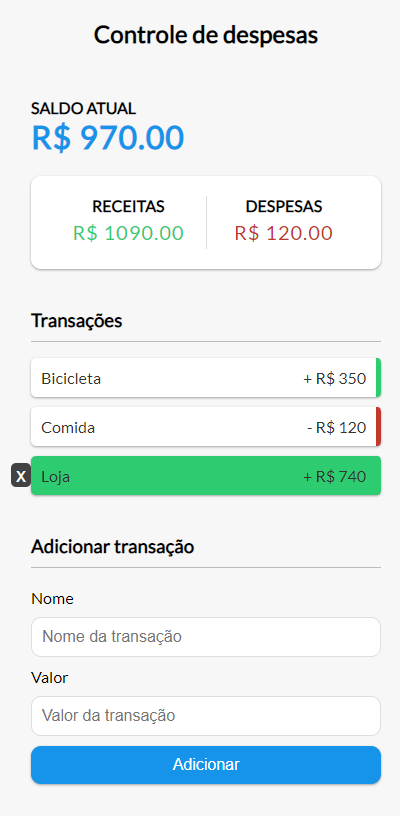

<h2 align="center">
  Controle de despesas JS
</h2>

<p align="center">
 <a href="#-sobre-o-projeto">Sobre</a> •
 <a href="#-tecnologias">Tecnologias</a> •
 <a href="#-aplicação">Aplicação</a> • 
 <a href="#-como-executar">Executar</a> 
</p>

## 💻 Sobre o projeto

Esse foi um dos primeiros projetos em JS que realizei, feito através de um curso no youtube. Fiz algumas melhorias na aplicação. Utiliza javascript puro. Os valores ficam hospedados no localstorage.

---

## 🛠 Tecnologias

As seguintes ferramentas foram usadas na construção do projeto:

-   **HTML**
-   **CSS**
-   **Javascript**

## 🚀 Aplicação

<p align="center">
  
</p>
---

## 🛠 COMO EXECUTAR

```

# Clone este repositório
$ git clone git@github.com:KaiqueBM/Controle-De-Despesas-JS.git

# Vá para a pasta do projeto
$ cd controle-de-despesas-js

# Abra o arquivo index.html

```
